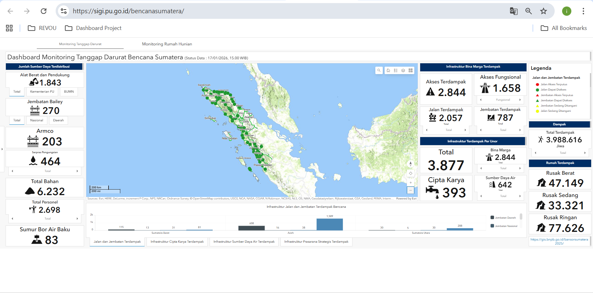
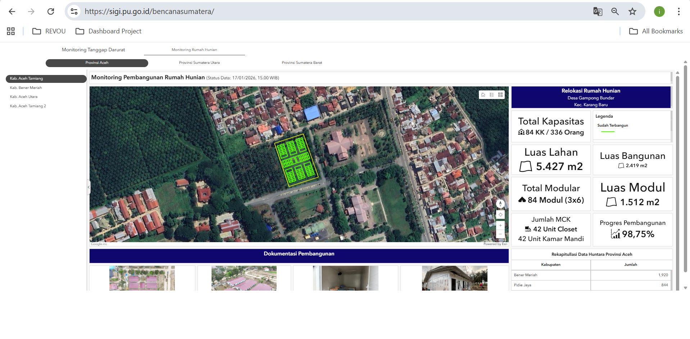

# Sumatra-flood-interactive-dashboard
This project presents an interactive dashboard developed to support disaster response decision-making within the Government of Indonesia (GoI). It provides a spatial overview of flood events across Sumatra, enabling faster situational assessment and informed response planning through interactive geospatial visualization.

## Project Overview
This project presents an interactive web-based dashboard developed to visualize and explore flood disaster events across Sumatra Island. The dashboard supports spatial analysis by integrating geographic distribution, temporal patterns, and disaster-related attributes into an intuitive visual interface. It aims to support the disaster response decision-making within the Secretariat General of the Ministry of Public Works.

---

## Live Dashboard
🔗 **Access the interactive dashboard:**  
https://sigi.pu.go.id/bencanasumatera/

---

## Dashboard Preview

---

## Key Features
- Interactive map displaying flood disaster distribution
- Spatial comparison across provinces and districts
- Resettlement progress and monitoring across provinces
- User-friendly navigation for spatial exploration

---
## Housing Reconstruction Progress Monitoring
In addition to flood event visualization, the dashboard provides a monitoring component for post-disaster housing reconstruction progress.

This feature enables stakeholders to track the status of housing development across affected regions, supporting transparency and coordination in post-disaster recovery efforts. By presenting spatial and temporal progress indicators, the dashboard assists decision-makers in identifying delays, prioritizing interventions, and evaluating overall recovery performance.

**Monitoring Capabilities:**
- Visualization of housing reconstruction progress by location
- Status tracking of housing units (planned, in progress, completed)
- Spatial comparison across affected districts
- Temporal updates to support progress evaluation

---  
  
## Tools & Technologies
- ArcGIS 
- Spatial data processing and visualization
- Web-based interactive dashboard development

---

## Use Case
This dashboard can be used for:
- Flood risk assessment and monitoring
- Disaster management planning
- Spatial decision support for policymakers
